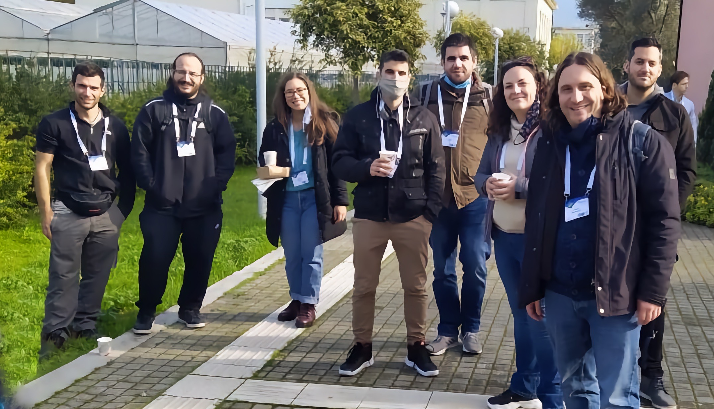
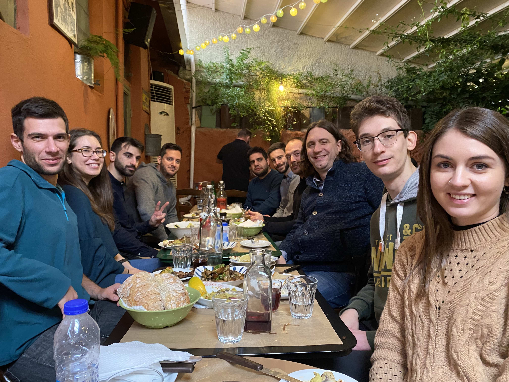

The first in-person conference of PREGO is a reality. 
We are very greatful that we joined the [9th conference of Mikrobiokosmos](https://mikrobiokosmos2021.org) in Athens from 16 to 18 December 2021 with an oral presentation. 
Very happy to meet our friends, watch presentations from our colleagues and learn so much about microbes from the community. 

PREGO is at the final stages so it was great to watch the interest of the audience for what is can offer to ease the knowledge discovery about microbes, environments and process.s

Last but not least, we seised the opportunity and submitted PREGO manuscript at the [Special Issue of the Conference](https://www.mdpi.com/journal/microorganisms/special_issues/Mikrobiokosmos9)!

